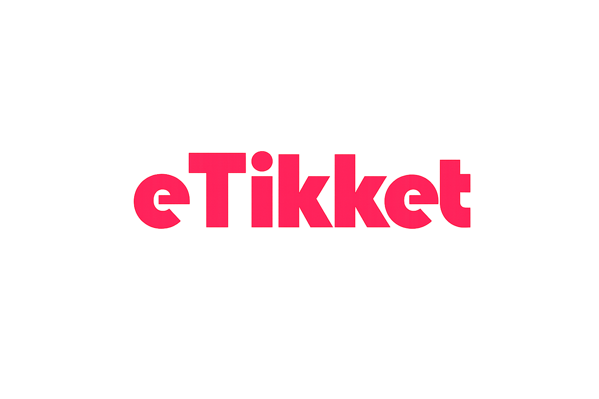

eTikket is a modern event ticketing platform designed to simplify ticket purchasing for events in Kenya.

Event organizers create events on the platform and receive a unique purchase link. They share this link directly with their audience via WhatsApp, SMS, email, or social media. Users click the link, pay for their ticket using M-Pesa STK Push, and receive a QR code ticket instantly. At the venue, organizers scan the QR code to verify and check-in attendees.

The platform eliminates physical tickets, reduces long queues, prevents forgery, and provides real-time sales tracking for organizers.